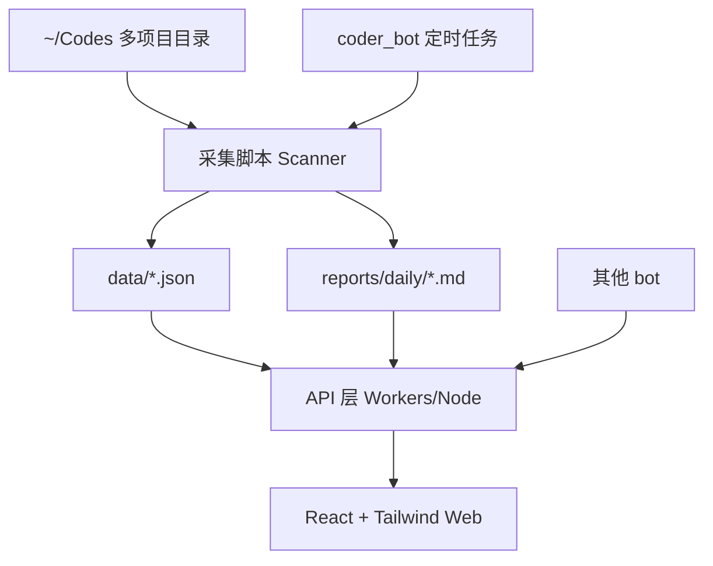

# PRD：项目监控平台（Project Monitor）

## 1. 产品概述

### 1.1 背景与目标
魔尊当前在 `~/Codes` 下维护多个项目（如 `ai-middleware`、`go-todo-app`、`product-showcase`），项目状态分散在各仓库内，日常查看成本高、改动追踪依赖手工。

本项目目标是建设一个可部署在 Cloudflare Pages/Workers 的轻量级 Web 监控平台，实现：
- 统一查看 `~/Codes` 下项目状态
- 每日自动抓取 Git 变更并沉淀为可读报告
- 支持 coder_bot 及其他 bot 自动生成项目文档
- 支持桌面端与移动端网页预览

### 1.2 产品定位
一个“本地目录 + Git 驱动、无数据库优先”的项目运行态可视化与日报平台。

### 1.3 目标用户
- **主用户**：技术负责人 / 项目 owner（魔尊）
- **协作用户**：coder_bot、其他自动化 bot

### 1.4 核心价值
1. **信息聚合**：从多仓库切换变为单页总览
2. **过程可见**：每日改动可追踪、可复盘
3. **自动化提效**：报告自动生成，减少手工整理
4. **可扩展协作**：预留 bot 接口，支持后续能力扩展

### 1.5 范围定义
- **In Scope（MVP）**
  - 项目扫描、项目列表、项目详情
  - Git 状态展示（分支、最近提交、变更统计）
  - 每日定时改动抓取
  - 日报/变更文档展示
  - 响应式 Web 页面
- **Out of Scope（当前不做）**
  - 多租户权限系统
  - 复杂任务编排 UI
  - 数据库存储与 BI 分析系统

---

## 2. 功能列表

### 2.1 功能优先级总览

| 功能 | 描述 | 优先级 |
|---|---|---|
| 项目列表 | 展示 `~/Codes` 下所有项目 | P0 |
| 项目详情 | 展示单项目基本信息与状态 | P0 |
| Git 状态 | 分支、提交数、工作区变更等 | P0 |
| 每日变更 | 每日自动抓取 git log 与文件改动 | P0 |
| 文档展示 | 展示自动生成的项目报告/日志 | P0 |
| Web 界面 | 响应式页面（桌面+移动） | P0 |
| 多 Bot 能力 | 提供统一调用接口 | P1 |

### 2.2 功能模块详细说明

#### F1. 项目列表（P0）
**目标**：快速看到 `~/Codes` 下所有可监控项目。

**输入**：配置的扫描根目录（默认 `~/Codes`）

**处理逻辑**：
- 扫描一级/多级子目录
- 识别 Git 仓库（存在 `.git` 或可执行 `git rev-parse --is-inside-work-tree`）
- 生成项目索引缓存（JSON 文件）

**输出字段建议**：
- 项目名
- 路径
- 默认分支/当前分支
- 最近提交时间
- 今日是否有改动（是/否）
- 状态标签（正常/脏工作区/扫描失败）

**验收点**：
- 可稳定列出目标目录下项目
- 非 Git 目录可忽略或标记

---

#### F2. 项目详情（P0）
**目标**：查看单项目完整状态与近期动态。

**展示信息建议**：
- 基础信息：项目名、路径、仓库 remote、默认分支
- Git 状态：
  - 当前分支
  - 工作区状态（clean/dirty）
  - staged/unstaged/untracked 文件数量
  - 最近 N 条提交（作者、时间、message、hash）
- 统计信息：
  - 今日提交数、近7日提交趋势
  - 本日文件变更统计（新增/修改/删除）

**验收点**：
- 打开任一项目可看到完整 git 状态
- 最近提交列表可用并可跳转 hash（本地或链接占位）

---

#### F3. Git 状态总览（P0）
**目标**：在总览页快速识别异常和活跃度。

**关键指标**：
- 分支名
- HEAD 最近提交时间
- ahead/behind（若可获取）
- 工作区是否有未提交变更
- 最近24小时提交次数

**异常识别规则建议**：
- 7天无提交：标黄（低活跃）
- 工作区脏且超过24小时未提交：标红（风险）
- 扫描失败：标灰并记录错误

---

#### F4. 每日变更抓取（P0）
**目标**：每日自动生成统一变更快照。

**触发方式**：
- 由 coder_bot 每日定时触发（如每天 09:00）
- 或通过脚本/HTTP endpoint 手动触发

**抓取内容**：
- 每个项目当日 `git log --since` 结果
- 文件变更摘要（`git diff --name-status` 或统计）
- 项目状态快照（分支、dirty 状态、提交计数）

**产物**：
- 结构化 JSON（供页面渲染）
- Markdown 报告（供人类阅读）

**建议目录结构**：
- `data/projects-index.json`
- `data/snapshots/YYYY-MM-DD.json`
- `reports/daily/YYYY-MM-DD.md`

---

#### F5. 文档展示（P0）
**目标**：Web 端直接查看自动生成报告。

**能力要求**：
- 列表展示日报（按日期倒序）
- 报告详情页展示 Markdown 内容
- 支持按项目筛选日报条目

**验收点**：
- 每日生成报告后，可在 Web 页面直接打开阅读

---

#### F6. 多 Bot 接口能力（P1）
**目标**：支持 coder_bot 之外的 bot 调用同一套数据与生成流程。

**最小接口建议**：
- `POST /api/scan`：触发项目扫描
- `POST /api/snapshot`：触发当日快照
- `POST /api/report`：生成日报
- `GET /api/projects`：读取项目列表
- `GET /api/reports?date=YYYY-MM-DD`：读取报告

**鉴权建议（MVP）**：
- 通过简单 token（环境变量）保护写操作接口

---

#### F7. 响应式 Web 界面（P0）
**目标**：桌面与移动端均可流畅查看。

**基本要求**：
- 首页（项目总览）在移动端可单列展示
- 详情页可折叠区域（提交列表、文件变更）
- 报告页支持长文滚动与目录锚点

---

## 3. 技术方案建议

### 3.1 总体架构（无数据库优先）



### 3.2 前端方案
- **技术栈**：React + TailwindCSS
- **部署**：Cloudflare Pages
- **数据读取**：
  - 方案A（推荐 MVP）：直接请求 Workers API
  - 方案B：读取 Pages 静态 JSON + Markdown（适用于纯静态）

### 3.3 后端/API 方案
- **优先方案**：Cloudflare Workers（轻量 API）
- **职责**：
  - 提供项目、快照、报告读取接口
  - 暴露触发采集与报告生成的 webhook（受 token 保护）
- **可替代**：本地 Node 服务（开发期）

### 3.4 数据存储方案（文件系统）
- 不引入数据库
- 使用 JSON + Markdown 作为唯一持久化层
- 优点：简单、可审计、可 Git 追踪、迁移成本低

### 3.5 定时任务与自动化
- **触发源**：coder_bot（定时）
- **执行链路**：
  1. 执行扫描脚本
  2. 生成当日快照 JSON
  3. 生成日报 Markdown
  4. 推送/同步到前端可读取位置

### 3.6 关键技术决策
1. **先文件后数据库**：满足当前规模，降低复杂度
2. **先读展示后写管理**：MVP 聚焦可视化与追踪
3. **接口标准化**：为多 bot 扩展预留一致入口

### 3.7 非功能需求
- **性能**：
  - 首页加载 < 2s（50 个项目规模）
  - 单项目详情 < 1.5s
- **可靠性**：
  - 采集失败不影响页面可用（显示最近一次成功快照）
- **安全性**：
  - API 写操作必须 token 校验
  - 路径访问白名单（仅允许 `~/Codes`）
- **兼容性**：
  - 支持现代浏览器（Chrome/Safari/Edge 最新两个大版本）
  - 移动端宽度 375px 起可用

### 3.8 风险与应对
- **风险1：项目数量增长导致扫描慢**
  - 对策：增量扫描 + 并发上限 + 缓存
- **风险2：Cloudflare 环境无法直接访问本地目录**
  - 对策：采集与生成在本地/CI 执行，Cloudflare 仅负责展示与 API 网关
- **风险3：Git 命令异常或权限问题**
  - 对策：按项目容错，记录错误并继续全局流程

---

## 4. 界面原型描述

### 4.1 信息架构
- `/` 项目总览
- `/project/:id` 项目详情
- `/reports` 日报列表
- `/reports/:date` 日报详情

### 4.2 页面原型（文字版）

#### 页面A：项目总览页
- 顶部：标题 + 最近更新时间 + 手动刷新按钮
- 统计卡片：
  - 项目总数
  - 今日有改动项目数
  - 脏工作区项目数
  - 扫描异常项目数
- 项目列表（卡片/表格切换）：
  - 项目名、分支、最近提交时间、状态标签
  - 点击进入项目详情

#### 页面B：项目详情页
- 基础信息区：路径、remote、分支、状态
- 指标区：今日提交数、近7日提交趋势（小图）
- 提交列表区：最近 N 条提交
- 文件变更区：新增/修改/删除文件列表
- 操作区：查看对应日报、回到总览

#### 页面C：日报列表页
- 日期倒序列表
- 支持按项目名筛选
- 每条展示：日期、涉及项目数、提交总数

#### 页面D：日报详情页
- Markdown 渲染内容
- 目录锚点（按项目分段）
- 支持复制/导出（后续）

### 4.3 响应式策略
- 桌面端：双栏/多栏布局
- 移动端：单列卡片 + 折叠内容
- 表格在移动端改为卡片摘要，避免横向滚动

### 4.4 交互原则
- 状态优先：颜色与标签快速识别风险
- 信息分层：先总览，后深入
- 异常可见：扫描失败必须可定位原因

---

## 5. 里程碑规划

### M0：需求冻结与技术验证（1-2 天）✅ 已完成
**目标**：确认目录结构、数据模型、命令可行性

**交付物**：
- ✅ 数据结构定义（projects-index / snapshot / report）
- ✅ Git 采集命令清单
- ✅ API 草案（脚本已实现）

**验收**：
- ✅ 在本机可跑通单项目扫描与报告生成

**完成时间**：2026-03-04

---

### M1：MVP 核心闭环（3-5 天）✅ 已完成
**范围（P0）**：
- 项目列表
- 项目详情
- Git 状态
- 每日变更抓取
- 文档展示（基础）

**交付物**：
- 前端基础页面（总览/详情/日报）
- 采集脚本 + JSON/MD 产物
- 基础 API（读取）

**前端状态**：✅ 已完成
- 技术栈：React 18 + TypeScript + Tailwind CSS 4 + Vite
- 路由：React Router v6
- 页面：项目总览、项目详情、日报列表、日报详情
- 数据：Mock 数据（待连接真实 API）

**API 状态**：✅ 已完成
- 技术栈：Hono + TypeScript + Cloudflare Workers
- 部署：https://project-monitor-api.inmanfu.workers.dev
- 接口：
  - `GET /api/projects` - 获取项目列表
  - `GET /api/projects/:name` - 获取项目详情
  - `GET /api/snapshots` - 获取快照日期列表
  - `GET /api/snapshots/:date` - 获取指定日期快照
  - `GET /api/reports` - 获取日报列表
  - `GET /api/reports/:date` - 获取日报内容（Markdown）
  - `POST /api/scan` - 触发扫描（预留接口）
- CORS：已配置，支持本地开发和 Cloudflare Pages
- 文档：`docs/API.md`

**验收**：✅ 全部通过
- [x] Workers 项目创建完成
- [x] API 接口实现完成
- [x] CORS 配置完成
- [x] 部署成功并返回可访问的 URL
- [x] 前端可以调用 API 获取数据

---

### M2：自动化与部署（2-3 天）🔄 进行中
**范围**：
- coder_bot 定时触发接入
- Cloudflare Pages/Workers 部署
- 移动端适配完善

**交付物**：
- 可访问线上地址
- 每日自动生成并可网页查看

**当前状态**：
- ✅ Cloudflare Workers API 已部署：https://project-monitor-api.inmanfu.workers.dev
- ✅ Cloudflare Pages 前端已部署（待确认 URL）
- ⏳ 前端待连接真实 API（当前使用 Mock 数据）
- ⏳ coder_bot 定时触发待接入

**待完成**：
- [ ] 前端连接真实 API
- [ ] 配置自动化扫描脚本
- [ ] 移动端适配完善

**验收**：
- 全部验收标准通过

---

### M3：扩展能力（P1，后续迭代）
**范围**：
- 多 bot 调用接口
- 报告模板可配置
- 告警（如连续 N 天无提交）

**交付物**：
- bot 接口文档
- 扩展 API（触发与查询）

---

## 6. 验收标准映射

| 验收项 | 对应功能 | 验收方式 |
|---|---|---|
| Web 页面可正常访问 | F7 | 打开部署地址可进入总览页 |
| 可列出 `~/Codes` 下所有项目 | F1 | 页面展示项目清单与数量 |
| 可查看项目 git 状态 | F2/F3 | 详情页可见分支、提交、变更状态 |
| 每日自动生成文档（可演示） | F4/F5 | 展示当日 markdown 报告并可访问 |
| 支持移动端预览 | F7 | 手机尺寸下页面可读可操作 |

---

## 7. 附录

### 7.1 建议目录结构

```text
~/Codes/project-monitor/
  ├─ docs/
  │   └─ PRD.md
  ├─ data/
  │   ├─ projects-index.json
  │   └─ snapshots/
  │       └─ YYYY-MM-DD.json
  ├─ reports/
  │   └─ daily/
  │       └─ YYYY-MM-DD.md
  ├─ scripts/
  │   ├─ scan-projects.sh (或 scan.ts)
  │   ├─ generate-snapshot.sh
  │   └─ generate-report.sh
  ├─ web/
  │   └─ (React + Tailwind)
  └─ worker/
      └─ (Cloudflare Workers API)
```

### 7.2 用户故事（MVP）
1. 作为技术负责人，我希望在一个页面看到所有项目状态，以便快速判断整体进度。
2. 作为技术负责人，我希望查看单项目最近提交和文件变化，以便追踪日常研发动态。
3. 作为自动化 bot，我希望通过统一接口触发扫描和报告生成，以便稳定执行每日任务。

### 7.3 发布建议
- 先本地验证脚本与数据结构，再接入 Web 展示
- 优先保证“可读、可查、可复盘”，再做高级分析
